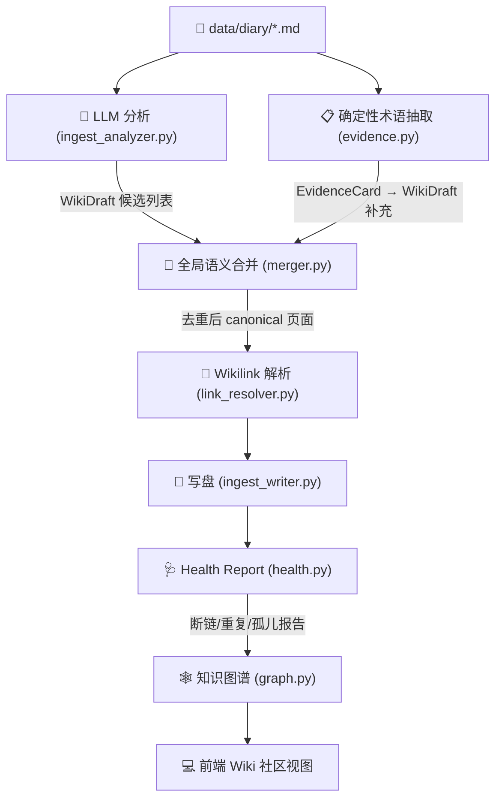

# DeepMemo x LLM Wiki 架构设计与编译演进规范

> 最后更新：2026-05-26（含代码审查修正）。基于 `reference/llm_wiki/llm_wiki` 的设计，并结合 DeepMemo 的全量日记编译、全局语义去重重构、Louvain 聚类优化以及未来的自进化 Agent 技能反哺路线，是一份完整的架构规格书。
> 
> 详细的思考过程和取舍论证见 [think.md](file:///Users/guoziyang/code/engineering_lab/DeepMemo/docx/ai/llm_wiki/think.md)。

---

## 1. 核心定位与设计哲学

DeepMemo 采用三层信息架构模型：

| 层 | 目录 | 所有者 | 职责 |
|---|---|---|---|
| **原始层 raw** | `data/diary/`, `data/raw/` | 用户 | 唯一真值来源。日记、爬虫内容、导入论文 |
| **知识层 wiki** | `data/wiki/` | LLM 编译 | diary 的结构化编译产物。全量 Rebuild 可随时重建 |
| **规则层 policy** | `data/policy/` | 用户定义 | 约束 LLM 如何提取、链接、引用、维护 |

**底线原则**：
- `wiki/` 是 `diary/` 的编译产物，不是手写文档。Rebuild 可随时覆盖。
- 冲突要保留不要抹平，证据不够就标推断。
- 先更新旧页面，再考虑新建页面。能合并就合并。

---

## 2. 目录规范

```text
data/
├── diary/              # 每日非结构化日记 (0301.md ~ 0524.md)
├── wiki/               # 编译产出
│   ├── index.md        # 全局导航索引
│   ├── log.md          # 编译操作追加日志
│   ├── overview.md     # 知识库快照与活跃主题
│   ├── sources/        # 日记摘要溯源页
│   ├── entities/       # 人、项目、产品、工具
│   ├── concepts/       # 框架、方法论、技术、经验法则
│   ├── syntheses/      # 跨社区综合决策与对比页
│   └── queries/        # 高质量问答归档
└── policy/             # 编译规则
    ├── purpose.md
    ├── schema.md
    ├── ingest-rules.md
    ├── citation-rules.md
    └── maintenance-rules.md
```

---

## 3. Frontmatter Schema 与页面类型

### 3.1 统一元数据
```yaml
---
title: "经验压缩谱系 (Experience Compression Spectrum)"  # 中英双语
type: concept          # source | entity | concept | synthesis | query
tags: [memory, agents, learning]
sources: ["0501.md", "0512.md"]  # 多来源溯源
last_updated: 2026-05-26
status: active         # draft | active | archived
aliases: ["经验压缩", "compression spectrum"]  # 支持中英文
related: [agent-skill-distillation, complementary-learning-systems]
---
```

### 3.2 各页面正文骨架

| 页面类型 | 核心 Sections | 触发条件 |
|---------|-------------|---------|
| **source** | Summary, Key Claims, Evidence, Contradictions | 每篇 diary 自动生成 1 个 |
| **entity** | Overview, Timeline, Key Properties, Open Questions | 具体的人/产品/工具/项目/论文 |
| **concept** | Definition, Why It Matters, Evidence, Related, Counterpoints | 抽象的框架/方法/模式/经验法则 |
| **synthesis** | Question, Evidence, Tradeoffs, Contradictions, Follow-ups | 社区触发或手动触发 |

---

## 4. 编译体系：全局提取 → 合并 → 链接 → 写盘

### 4.1 数据流总览



> **关于 evidence.py 的定位澄清**：
> 早期 design 中提到"砍掉 Evidence Card 独立层"，指的是砍掉**基于 LLM 的语义级证据抽取**（消耗 token、增加延迟）。当前保留的 `evidence.py` 做的是**确定性正则抽取**（regex 提取 Markdown 链接标题、CamelCase 英文词组），**零 LLM 调用**，用于补充 LLM 分析可能遗漏的术语。两者不是同一件事。
>
> - LLM 路径：`ingest_analyzer.py` → 理解语义，提取概念/实体/关系
> - 确定性路径：`evidence.py` → 正则匹配高频术语，补充 LLM 盲区
> - 两路产出均进入 `merger.py` 做全局去重

### 4.2 LLM 提取增强（Phase 1: Analyze）

当前 `analyze_entry()` 的 LLM prompt 需要从 5 行扩展为结构化指令，注入 `ingest-rules.md` 的核心规则。

**当前问题**（代码审查发现）：
- `ingest_analyzer.py` L279-286 的 system prompt 只有 5 行，没有 JSON schema 示例
- 提到 "mock diary" 但实际处理的是真实日记
- 没有注入 `ingest-rules.md` 规则
- 没有 entity vs concept 判断标准
- 没有要求 `source_section` 字段

**增强后的 prompt 结构**：
```
System:
你是 DeepMemo 知识编译器。阅读日记条目，提取结构化知识。

规则（来自 ingest-rules.md）：
- 反复出现的概念、明确成立的工程判断、被多来源支撑的内容 → 进 wiki
- 一次性情绪、临时任务、无证据猜测 → 不进 wiki
- 具体对象（人/产品/工具/论文） → entity；抽象方法（框架/模式/经验法则） → concept

输出 JSON Schema：
{
  "source": { "title": str, "summary": str, "key_claims": [str] },
  "entities": [{
    "slug": str,           // 英文 kebab-case
    "title": str,          // 中英双语，如 "LightRAG (轻量级图增强检索)"
    "summary": str,
    "tags": [str],
    "source_section": str, // 来自日记的哪个 section: 科研/工程博客/开发经验/others
    "importance": "high" | "normal"
  }],
  "concepts": [同上结构],
  "relations": [{          // P2：概念间关系（当前无消费端，待实现）
    "from": str,           // slug
    "to": str,             // slug
    "type": "evolves-from" | "compares-to" | "is-part-of" | "complements"
  }],
  "open_questions": [{     // P2：提取日记中的"待讨论"段落（当前无消费端，待实现）
    "question": str,
    "related_concepts": [str]
  }]
}
```

**关键改进点**：
1. 注入了 `ingest-rules.md` 的判断标准，避免 LLM 把临时任务也提取为 concept
2. 要求输出 `source_section`，知道每个概念来自科研还是工程博客
3. 新增 `relations[]` 字段，捕捉概念间的演进/对比/互补关系
4. 新增 `open_questions[]`，专门提取日记中的"待讨论"段落

> **P2 标注说明**：`relations[]` 和 `open_questions[]` 目前没有消费端代码。LLM 提取后不会被 `ingest_analyzer.py` 解析，`graph.py` 也不处理 relations，`ingest_writer.py` 不渲染 open_questions。先在 prompt 中要求输出（LLM 可以提），等后续实现消费端再激活。

### 4.3 全局语义合并（Phase 2: Merge）

`merger.py` 保持当前的两级策略：

1. **确定性规范化**：标题大小写、连字符、空格统一；完全同名直接合并
2. **启发式聚类**：Levenshtein ratio >= 0.78 或 word Jaccard >= 0.75 的候选标记为同簇
3. **LLM 小簇判定**：对启发式无法确定的候选簇（通常 2-5 个），发给 LLM 做 pairwise 判断
4. **Alias 保留**：被合并页面的旧标题存入 aliases，用于后续 wikilink 解析和增量 ingest 匹配

**合并后的信号保留**：
- `sources[]` 累积所有被合并页面的来源日记
- `tags[]` 取并集并去重
- `sections[]` 按 heading 合并（同名 heading 的 bullets 拼接去重）
- `related[]` 利用 Phase 1 抽取的 `relations[]` 自动填充（P2 待实现，当前基于 source overlap 计算）

> **已修复 Bug**：`merger.py` 的 `llm_clustering()` 中，LLM 调用失败后打印了 "Falling back to heuristics" 但实际没有执行 fallback——该 type 的候选直接被设为 self-mapping（等于不做任何合并）。已修复为在 except 块中执行 `heuristic_clustering(type_drafts)`。

### 4.4 链接解析与 Health Report（Phase 3: Resolve + Validate）

**两阶段策略**（代替原设计中的"静默降级"）：

| 阶段 | 处理 | 结果 |
|------|------|------|
| **Rebuild 时** | 扫描所有 `[[wikilink]]`，尝试用 title/slug/alias 全局索引匹配 | 可匹配的 → 重写为 canonical title |
| **Health Report** | 不可匹配的 → **保留 `[[target]]` 原样** | 由 `health.py` 报告 dangling links |
| **前端渲染** | 未解析 wikilinks 显示为虚线下划线样式 | 用户可点击查看 health report 并决定处理方式 |

> **代码审查修正**：原 `link_resolver.py` L114-116 对不可解析的 wikilink **静默降级为纯文本**（直接删掉 `[[]]`），与上述设计矛盾。已修正为保留 `[[target]]` 不降级。

**模糊匹配约束加强**（代码审查发现）：

原逻辑（L58-61）对 >= 6 字符的查询做 substring 匹配，存在三个问题：
1. `"prompt"` 会误匹配 `"prompt engineering"`、`"system prompt"` 中的**第一个**
2. 缺少长度比例约束（短字符串匹配到长字符串的子串 → false positive）
3. 返回第一个匹配而非最佳匹配

修正后规则：
- 阈值提高到 >= 8 字符
- 加长度比例约束 `min(len_a, len_b) / max(len_a, len_b) >= 0.5`
- 选择比例最高的匹配而非第一个匹配

**Health Report 输出格式**（`health.py` 需按此补齐）：
```json
{
  "timestamp": "2026-05-26T10:00:00",
  "stats": {
    "total_pages": 150,
    "source_backed_pages": 148,
    "multi_source_pages": 90,
    "total_wikilinks": 200,
    "resolved_wikilinks": 185,
    "dangling_wikilinks": 15
  },
  "dangling_links": [
    { "target": "LLM Memory Systems", "referenced_by": ["agent-evolution.md"], "possible_match": "memory-augmented-generation" }
  ],
  "duplicate_candidates": [
    { "pair": ["agentic-query-rewriting", "agentic-rewrites"], "similarity": 0.82 }
  ],
  "orphan_pages": ["some-concept-without-incoming-links.md"],
  "stub_pages": ["concept-with-only-title.md"]
}
```

> **health.py 当前状态**：已实现 `dangling_links` 和 `duplicate_candidates`，但缺少 `orphan_pages`、`stub_pages`、`multi_source_pages`、`timestamp`、`possible_match` 字段。标记为 P2。

### 4.5 知识图谱 Louvain 聚类（Phase 4: Graph）

**核心规则不变**：
1. Source 节点排除出 Louvain 聚类，聚类后归属到最强语义邻居的社区
2. 4D 边权公式：
   $$\text{W} = \frac{3.0 \cdot \text{DirectLink} + 4.0 \cdot \text{SourceOverlap} + 1.5 \cdot \text{AdamicAdar} + 1.0 \cdot \text{TypeAffinity}}{9.5}$$
3. 边阈值 `EDGE_THRESHOLD = 0.12`

**新增：利用 `relations[]` 信号**（P2 待实现）：
- Phase 1 抽取的 `relations[]`（evolves-from, compares-to 等）转化为 DirectLink 信号
- 例如 `{"from": "graphrag", "to": "lightrag", "type": "evolves-from"}` → `direct_link("graphrag", "lightrag") = 0.8`
- 这比等 wikilink 被 LLM 自由生成后再解析要可靠得多
- 当前 `graph.py` 的 `_compute_pair_metrics` 不处理 relations，需等 4.2 的消费端实现后对接

### 4.6 Related 链接计算

`ingest.py` 中基于 source overlap 的 Jaccard 相似度计算 related 链接。

**代码审查修正**：原阈值 `score < 0.4` 过高。对于 85 篇日记中的 200+ 页面，大多数页面只有 1-2 个 source，Jaccard 0.4 导致几乎没有页面产生 related 链接。

示例：页面 A sources=[0427.md, 0501.md]，页面 B sources=[0501.md, 0522.md]，Jaccard = 1/3 ≈ 0.33 被过滤。

修正为 `score < 0.15`，允许只有 1 个共同来源的页面也产生 related 链接（只要各自来源不超过 6-7 个）。

---

## 5. Synthesis 自动生成设计 [P1 待实现]

这是当前最大的功能空白。之前 225 个页面中只有 1 个 synthesis。

> **实现状态**：设计已完成，代码未实现。当前没有 `synthesis_generator.py` 模块，`/wiki/rebuild` 不调用任何 synthesis 生成，`graph.py` 的 Louvain 聚类产出社区但没有代码把社区成员传给 synthesis 生成器。

### 5.1 触发条件

| 触发方式 | 条件 | 说明 |
|---------|------|------|
| **社区触发** | Louvain 社区成员 >= 5 个概念/实体页面，且社区内边密度 >= 0.2 | 全量 Rebuild 后自动扫描 |
| **手动触发** | 用户在前端选择多个页面，点击"生成综合分析" | 人工选择的页面组 |
| **冲突触发** | Health Report 检测到同一主题下存在明显矛盾（如 RAG 两种技术路线） | 自动标记需要 synthesis |

### 5.2 上下文组装策略

```python
def assemble_synthesis_context(community_members: list[WikiPage]) -> str:
    """
    按时间排序社区内所有成员的核心信息，
    构建给 LLM 的综合分析上下文。
    """
    context_parts = []
    # 按 sources 中最早的日期排序
    sorted_members = sorted(community_members, key=lambda p: min(p.sources))
    
    for page in sorted_members:
        context_parts.append(f"""
### {page.title} ({page.type})
- 来源: {', '.join(page.sources)}
- 摘要: {page.summary}
- 核心证据:
{chr(10).join('  - ' + b for s in page.sections for b in s.bullets[:3])}
""")
    
    return '\n'.join(context_parts)
```

### 5.3 Synthesis Prompt 模板

```
你是 DeepMemo 的知识综合分析器。

以下是属于同一主题社区的 {N} 个知识页面。请生成一份综合决策分析。

要求：
1. 用一个核心问题作为标题（例如："Agent 技能蒸馏：哪些知识真正可以被 Skill 化？"）
2. Evidence：综述各方观点，按时间线串联演进逻辑
3. Tradeoffs：列出关键权衡（如成本 vs 质量、通用性 vs 领域适配性）
4. Contradictions：标注各方的矛盾点（如"SkillsBench 说 skill 提升 16.2%"与"腾讯实践说多数 skill 并不节省 token"）
5. Follow-ups：提出 2-3 个值得进一步追踪的方向
6. 必须引用至少 3 个不同的源页面

输出为 Markdown，遵循 synthesis 页面骨架。
```

### 5.4 质量校验

- 生成的 synthesis 必须引用 >= 3 个不同的 concept/entity 页面
- 必须包含至少 1 个 Contradiction 或 Tradeoff
- sources 字段应为所有被引用页面的 sources 的并集
- 如果校验不通过，标记为 `status: draft` 并进入 Health Report

---

## 6. 增量 Ingest 流程

### 6.1 架构割裂问题（代码审查发现）

当前全量和增量是两条完全不同的代码路径：

| | 全量 Rebuild (`ingest.py`) | 增量 Ingest (`ingest_pipeline.py`) |
|---|---|---|
| LLM 调用 | 1 次/日记，输出 JSON（entities/concepts） | **2 次/日记**，先 analysis 再 generation (FILE blocks) |
| 合并 | 全局 merger.py 语义去重 | **无全局合并**，只对齐已有页面 slug |
| 证据 | evidence.py 确定性抽取补充 | **无 evidence** 参与 |
| 链接 | 全局 link_resolver | 局部 resolve_draft_links |
| 产出质量 | 较高（全局去重 + evidence 补充） | 较差（无全局去重、无 evidence） |

`batch_ingest.py` 更严重——逐文件调 `auto_ingest()` 当全量用，85 篇日记 = 170 次 LLM 调用且无去重。已修复为改调 `run_diary_wiki_ingest()`。

### 6.2 当前实际增量流程（`auto_ingest()`）

```
1. Phase 1: Analysis — LLM 分析日记，提取 entities/concepts/arguments
2. Phase 2: Generation — LLM 生成完整 FILE blocks
3. Phase 3: 解析 FILE blocks → 逐一对齐已有 wiki slug → merge
4. Phase 4: link_resolver + 写盘
```

这个流程的问题：LLM 自由生成完整 Markdown 页面，格式不可控、内容难对齐。

### 6.3 优化后的目标流程（P2 待重构）

增量 ingest 应**复用全量路径的 `analyze_entry()` + `merger.py` 组件**，而非独立实现。增量的特殊性只在于：(1) 只分析 1 篇日记 (2) 与已有页面做 diff-patch 而非全量覆盖。

```
1. Phase 1: LLM 分析日记 → 输出 {entities[], concepts[]}（复用 analyze_entry）
   （不生成完整页面，只提取候选 terms）

2. Phase 2: 确定性对齐
   - 遍历 candidates，逐一匹配已有 wiki 页面的 title/slug/aliases
   - 完全匹配 → 标记为 UPDATE（后续 patch 到已有页面）
   - 无匹配 → 检查 ingest-rules（是否满足"什么该进 wiki"的条件）
     - 满足 → 标记为 CREATE
     - 不满足 → 标记为 SKIP（记入 log.md）

3. Phase 3: 执行写入
   - UPDATE: 追加 source 到 sources[]，合并新 evidence 到 sections，更新 last_updated
   - CREATE: 生成新 WikiDraft，写入文件
   - 运行 link_resolver 重新扫描受影响页面的 wikilinks

4. Phase 4: 刷新元文件
   - 更新 index.md, overview.md, 追加 log.md
```

---

## 7. 自进化智能体演进路线 (Future Roadmap)

```
Episodic Memory (日记)
     │ (批量/增量 Ingest)
     ▼
Semantic Memory (Wiki 概念与实体)
     │ (当 sources >= N 且包含操作性 SOP)
     ▼
Procedural Memory (自动编译成 .agents/skills/)
```

### 7.1 概念到 Executable Skill 的自动编译
当某个 concept 页面满足以下条件时触发技能蒸馏：
- `sources` >= 3（被多篇日记反复提及，说明是稳定知识）
- 正文中包含操作性步骤（CLI 命令、工具调用、Workflow 描述）
- `importance: high` 标记的证据条目 >= 2

产出 `.agents/skills/<name>/SKILL.md` 并注册到 `skills.db`。

### 7.2 知识生命周期与时序冲突消解
- 当新日记与已有 wiki 事实矛盾时，系统根据 Sources 的日期构建演进时间轴
- concept 页面中增加 `## Timeline` section，自动标注技术路线变迁
- 借鉴 0511.md 中"腾讯知识库"的三级成熟度衰减机制：
  - `proven` → 12个月未被新日记引用 → 降级为 `verified`
  - `verified` → 6个月未引用 → 降级为 `draft`

### 7.3 Synthesis 反哺 Agent 决策
当 Agent 在 QA 模式下被问到技术选型或对比类问题时：
- 优先检索 `syntheses/` 下的综合分析页
- 如果相关社区尚未生成 synthesis，触发按需生成

---

## 8. 代码模块拆分

```text
src/wiki/
├── constants.py          # 路径常量、页面类型、状态枚举
├── path_utils.py         # 路径安全检查
├── frontmatter.py        # YAML 元数据解析/序列化
├── storage.py            # 文件 CRUD + MD5 hash
├── tree.py               # data/ 目录树递归扫描
├── policy.py             # data/policy/*.md 加载
├── ingest_analyzer.py    # LLM 分析器 + WikiDraft 数据结构 + 启发式分析回退
├── evidence.py           # 确定性术语抽取（regex-based，零 LLM 调用）
├── ingest_writer.py      # 页面渲染 + index/overview/log 生成
├── merger.py             # 全局语义合并（Levenshtein + Jaccard + LLM 小簇判定）
├── link_resolver.py      # Wikilink 全局解析（三重索引 + alias 匹配 + 不降级死链）
├── health.py             # Health Report 输出（dangling links + duplicate candidates）
├── graph.py              # 4D 边权 + Louvain 聚类 + 洞察引擎
├── ingest.py             # 全量 Rebuild 主控
├── ingest_pipeline.py    # 增量单文件 Ingest（P2 待重构为复用全量组件）
├── batch_ingest.py       # CLI 入口（调用 run_diary_wiki_ingest）
└── test_reconstruction.py
```

> **跨模块依赖问题**：`_normalize_lookup()` 在 `graph.py`（L401）和 `health.py`（L15-16）各有一份独立实现，`link_resolver.py` 和 `ingest_pipeline.py` 从 `graph.py` 导入其下划线私有函数。P2 应提到共享模块（如 `text_utils.py`）。

---

## 9. 已知 Bug 与待修复项

### 9.1 已修复（2026-05-26 代码审查批次）

| # | 位置 | 问题 | 修复 |
|---|------|------|------|
| 1 | `graph.py` L628 vs L859 | `_type_affinity()` 重复定义，第二个覆盖第一个 | 删除第二个定义，保留含 synthesis 分支的完整版 |
| 2 | `link_resolver.py` L58-61 | 6 字符 substring 匹配过于激进 | 阈值→8，加比例约束 ≥0.5，选最佳匹配 |
| 3 | `link_resolver.py` L114-116 | 死链静默降级为纯文本 | 保留 `[[target]]` 不降级，由 health 报告 |
| 4 | `merger.py` `llm_clustering()` | LLM 失败后只打 log 没执行 heuristic fallback | except 块中补调 `heuristic_clustering()` |
| 5 | `batch_ingest.py` | 逐文件调 `auto_ingest()`，无全局 merge | 改调 `run_diary_wiki_ingest()` |
| 6 | `ingest.py` L325 | related 计算 Jaccard 阈值 0.4 过高 | 降低到 0.15 |
| 7 | `ingest.py` | 全链路缺少时间戳日志 | 增加总耗时和各阶段耗时 |
| 8 | `merger.py` / `evidence.py` | 无日志输出 | 增加 before/after 数量和耗时日志 |

### 9.2 未修复

| # | 位置 | 问题 | 影响 | 优先级 |
|---|------|------|------|--------|
| 1 | `ingest_analyzer.py` L279-286 | LLM prompt 只有 5 行，无 schema 示例 | 提取质量差 | P1 |
| 2 | `ingest_pipeline.py` | 增量路径与全量路径架构割裂（见 §6.1） | 增量质量差 | P2 |
| 3 | `App.tsx` L208 | `buildWikiGraph()` 是空函数 | 死代码 | P2 |
| 4 | `App.tsx` ModeSidebar | `filteredCommunities` 被计算但未渲染 | 死代码 | P2 |
| 5 | `health.py` | 缺少 orphan_pages/stub_pages/timestamp 等字段 | Health Report 不完整 | P2 |
| 6 | 多模块 | `_normalize_lookup()` 在 graph.py 和 health.py 各有独立实现 | 维护风险 | P2 |

---

## 10. 历史进展

### 2026-05-22：前端 Mock + 后端骨架
- 完成三栏布局（文件树 / 内容区 / 引用面板）
- 打通 `GET /wiki/tree`, `GET /wiki/pages` 等 API

### 2026-05-23：输入源收拢 + 编辑器适配
- AI HOT 爬虫产物迁至 `data/raw/daily/`
- 引入 Vditor Markdown 编辑器

### 2026-05-24：全局去重重构实施
- **merger.py**：实现混合聚类合并
- **link_resolver.py**：三重索引 + alias 重写
- **graph.py**：Louvain 排除 Source 节点
- **ingest_pipeline.py**：增量 Merge-Back

### 2026-05-25-26：设计审视与优化规划
- 发现 `data/wiki/` 已被清空，重建尚未实际运行
- 完成日记数据的深度分析，发现跨日记的概念演进链（Skill/RAG/Agent 三条主线）
- 诊断出 LLM prompt 质量不足、Synthesis 生成机制缺失、Health Report 未实现等核心空白
- 优化 design.md：砍掉过度设计（Evidence Card 独立层），补充务实方案（Prompt 增强、Synthesis 触发、两阶段死链处理）

### 2026-05-26：全面代码审查与修复
- 对照 design.md 逐模块审查 13 个 Python 文件，发现 6 个方案层问题 + 12 个代码层问题
- **P0 修复**：`graph.py` 删除重复 `_type_affinity`、`merger.py` 补 heuristic fallback、`batch_ingest.py` 改调正确入口
- **P1 修复**：`link_resolver.py` 模糊匹配约束 + 不降级死链、`ingest.py` related 阈值调整
- **日志增强**：`merger.py`、`evidence.py`、`link_resolver.py`、`ingest.py` 全链路加时间戳日志
- 方案层修正：澄清 evidence.py 定位（确定性抽取 ≠ LLM EvidenceCard）、标注 relations/open_questions 为 P2、记录全量/增量架构割裂问题
