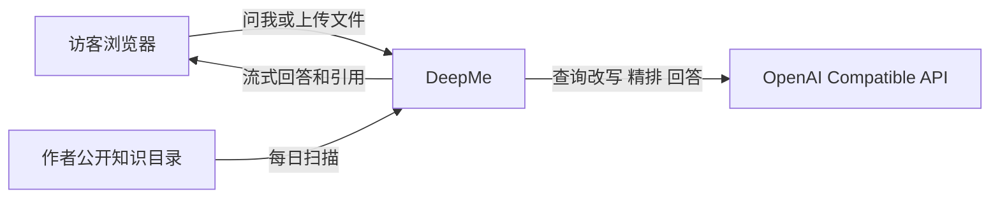
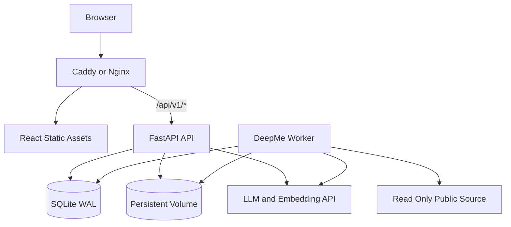
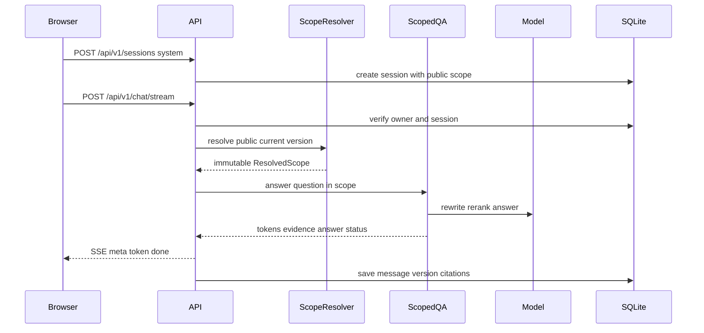
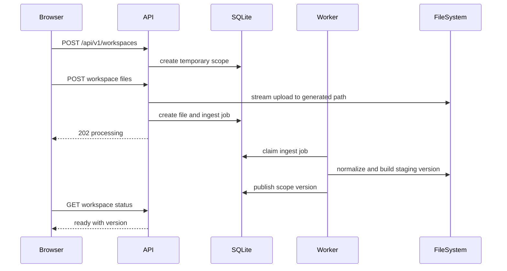

# DeepMe 系统架构设计

## 1. 文档信息

| 项目 | 内容 |
| --- | --- |
| 文档状态 | Implemented for MVP |
| 对应 PRD | `docs/product/deepme-prd.md` |
| 目标版本 | DeepMe MVP |
| 创建日期 | 2026-08-12 |
| 当前分支 | `deepme` |

## 2. 架构结论

DeepMe 保留 DeepMemo 已有的问答内核，重新组织知识边界、运行方式和公开界面。

系统只有一个默认作者站点，不提供账户、个人主页或长期云端知识托管。`knowledge_scope` 用于隔离作者公开知识库和匿名临时上传空间，它是安全边界，不代表产品要扩展成多用户平台。

MVP 采用以下结构。

- React 构建公开页面，只呈现“问我”和“问你的资料”。
- FastAPI 提供站点信息、匿名会话、上传、问答、引用和删除接口。
- 独立 Worker 处理文件解析、知识版本构建、每日检查和到期清理。
- SQLite 保存 scope、版本、任务、会话和消息状态。
- 文件系统保存不可变公开知识版本和临时上传文件。
- 每个知识版本拥有独立检索索引。
- 在线默认使用 Ngram、Embedding 和 LLM 精排，Embedding 不可用时退化为 Ngram。
- 系统不依赖外部向量数据库、Redis、Celery 或用户认证服务。

## 3. 设计约束

### 3.1 必须保持

- Markdown 原文是作者知识的长期真值。
- 回答必须绑定当前知识范围和知识版本。
- 事实回答必须带来源。
- 临时文件不能进入作者知识库、Knowledge Cards 或训练数据。
- scope 缺失或失效时必须拒绝请求，不能回退到默认知识库。
- 新公开知识版本构建失败时继续提供旧版本。

### 3.2 MVP 运行边界

- 单站点部署。
- 单个 API 实例。
- 单个 Worker 实例。
- API 和 Worker 使用同一持久卷与 SQLite 数据库。
- 匿名会话默认保留24小时。
- 临时上传空间默认保留24小时。
- PDF 仅支持可直接提取文本的文件，暂不做 OCR。
- Web Search、Chat Tools、`/knowledge` 命令和聊天记忆提取在公开产品中关闭。

## 4. 关键架构决策

| 编号 | 决策 | 理由 |
| --- | --- | --- |
| ADR-001 | 按请求解析 scope，取消全局 QA 单例 | 全局 `data/` 无法保证临时文件隔离 |
| ADR-002 | 知识版本不可变 | 保证回答、引用和回滚可复现 |
| ADR-003 | API 与 Worker 分进程 | 文件解析和索引构建不能阻塞 SSE |
| ADR-004 | SQLite 同时承担状态库和轻量任务队列 | MVP 不需要引入 Redis 和 Celery |
| ADR-005 | 原始 Markdown 与检索索引分开 | 索引可以重建，原文继续作为证据 |
| ADR-006 | 在线默认采用 Hybrid 检索 | 中文知识库仅靠固定字符串搜索召回不足 |
| ADR-007 | 临时文件先规范化为 Markdown | 复用同一套切片、引用和检索流程 |
| ADR-008 | 公开和临时 scope 使用同一问答服务 | 避免两套 RAG 行为逐渐分叉 |
| ADR-009 | 前端与 API 同源部署 | 简化 Cookie、CORS 和上传安全配置 |
| ADR-010 | 公共知识源通过只读目录接入 | 应用不保存 Git 凭证，也不执行任意同步命令 |

## 5. 系统上下文



作者公开知识目录由部署系统以只读方式挂载。它可以来自独立私有仓库的工作副本，也可以是自部署用户指定的本地目录。DeepMe 只读取目录和构建版本，不负责保管仓库凭证。

## 6. 部署拓扑



MVP 使用一个容器镜像和两个启动命令。

```text
deepme-api     uv run uvicorn src.app.main:app --host 0.0.0.0 --port 8000
deepme-worker  uv run python -m src.deepme.worker
```

边缘代理负责 TLS、请求体上限、静态资源和 `/api/v1` 转发。API 与 Worker 共享持久卷。Uvicorn 使用单 Worker，避免多个进程重复启动后台任务。

## 7. 文件系统布局

```text
runtime/
├── state/
│   └── deepme.db
├── public/
│   ├── staging/
│   │   └── <build_id>/
│   └── releases/
│       └── <knowledge_version>/
│           ├── documents/
│           ├── index/
│           │   └── search.sqlite3
│           ├── manifest.json
│           └── regression.json
├── temporary/
│   └── <workspace_id>/
│       ├── uploads/
│       ├── staging/
│       └── versions/
│           └── <knowledge_version>/
│               ├── documents/
│               ├── source-maps/
│               ├── index/
│               │   └── search.sqlite3
│               └── manifest.json
└── jobs/
    └── parser-tmp/
```

所有目录由服务端根据 ID 生成。用户文件名只作为展示字段保存，不能参与磁盘路径拼接。

## 8. 领域对象

### 8.1 Knowledge Scope

`KnowledgeScope` 表示一次允许访问的知识范围。

```text
scope_id
scope_type          system | temporary
owner_key           system scope 为空
status              empty | processing | ready | error | deleting | deleted
current_version
created_at
expires_at
deleted_at
```

约束如下。

- 系统中只有一个 `system` scope，固定逻辑名称为 `public`。
- 临时 scope 必须绑定匿名访客的 `owner_key`。
- scope 根目录由服务端配置和 ID 推导，不能从请求中接收。
- `deleting` 和 `deleted` 状态立即拒绝读取。

### 8.2 Knowledge Version

`KnowledgeVersion` 是不可变的可查询快照。

```text
scope_id
version
content_hash
manifest_path
index_path
status              building | validating | ready | rejected
source_revision
built_at
published_at
```

每次问答开始时，`ScopeResolver` 解析一次当前版本。后续检索、回答和引用都使用这份 `ResolvedScope`，发布过程中切换版本不会影响正在执行的请求。

### 8.3 Anonymous Visitor

访客第一次访问站点时获得签名的 HttpOnly Cookie。

```text
cookie_name         deepme_visitor
cookie_value        random_id.signature
same_site           lax
secure              production true
max_age             configurable
```

服务端验证签名后计算 `owner_key`。数据库不保存原始 Cookie。公开会话和临时 scope 都绑定 `owner_key`，因此其他访客即使猜到 UUID 也无法读取。

### 8.4 Session 与 Message

会话创建后固定绑定一个 scope，不能在“问我”和“问你的资料”之间切换。

```text
session
  session_id
  owner_key
  scope_id
  session_name
  session_topic
  session_summary
  created_at
  updated_at
  expires_at

message
  message_id
  session_id
  role
  content
  answer_status
  knowledge_scope_id
  knowledge_version
  citations_json
  created_at
```

`knowledge_version` 记录每条回答实际使用的版本。会话存在期间遇到公开知识更新，新回答可以使用新版本，旧回答仍保留原版本信息。

### 8.5 Upload File

```text
file_id
scope_id
original_name
stored_name
content_type
byte_size
sha256
parse_status        pending | parsing | ready | error | deleted
error_code
created_at
```

### 8.6 Job

```text
job_id
job_type            ingest_file | build_scope | publish_public | delete_scope
scope_id
payload_json
status              queued | running | succeeded | failed
attempts
available_at
locked_at
last_error
created_at
updated_at
```

Worker 使用 `BEGIN IMMEDIATE` 原子领取任务。失败任务按上限重试，永久失败后保留错误码供前端展示。

## 9. 核心组件

### 9.1 Public Web App

公开前端只保留以下组件。

- `SiteHeader`
- `ModeSwitcher`
- `AuthorProfile`
- `SuggestedQuestions`
- `ChatThread`
- `ChatComposer`
- `CitationDrawer`
- `UploadPanel`
- `WorkspaceStatus`
- `KnowledgeVersionBadge`

Editor、Wiki、文件树、Pulse 和 Knowledge Cards 页面不进入公开构建。内部能力可以暂时留在源码中，但路由和导航不能暴露。

前端按 scope 分开保存会话状态。切换模式时选择对应会话，不能复用另一模式的消息和引用。

### 9.2 API Layer

API 负责以下工作。

- 建立和验证匿名访客身份。
- 校验 session 与 scope 所有权。
- 接收流式问答请求。
- 接收上传并创建异步任务。
- 返回文件处理、scope 和删除状态。
- 返回消息引用。
- 暴露站点配置和公开知识版本。

API 不执行 PDF 解析、全量索引构建或目录同步。

### 9.3 Scope Registry

`ScopeRegistry` 负责 scope 元数据，不直接读取文档。

核心接口如下。

```python
class ScopeRegistry:
    def get_public_scope(self) -> KnowledgeScope: ...
    def create_temporary_scope(self, owner_key: str) -> KnowledgeScope: ...
    def require_access(self, scope_id: str, owner_key: str | None) -> KnowledgeScope: ...
    def publish_version(self, scope_id: str, version: str) -> None: ...
    def mark_deleting(self, scope_id: str, owner_key: str) -> None: ...
```

### 9.4 Scope Resolver

`ScopeResolver` 把数据库元数据转换为只读运行对象。

```python
@dataclass(frozen=True)
class ResolvedScope:
    scope_id: str
    scope_type: str
    knowledge_version: str
    documents_root: Path
    index_path: Path
    manifest_path: Path
```

Resolver 必须重新验证所有路径都位于配置的 runtime 根目录内。解析失败时返回 scope 错误，不能使用默认目录兜底。

### 9.5 Scoped QA Factory

现有全局 `knowledge_qa_service` 改为请求级工厂。

```python
class ScopedQAServiceFactory:
    def create(self, scope: ResolvedScope) -> KnowledgeQAService: ...
```

工厂按 `scope_id + knowledge_version` 缓存只读检索器。发布新版本后自然产生新的缓存键。临时 scope 删除时主动失效对应缓存。

`KnowledgeQAService` 接收以下依赖。

- `ScopeAwareQueryRouter`
- `HybridChunkRetriever`
- `AnswerComposer`
- `AnswerGuard`
- `QueryRewriter`

### 9.6 Document Normalizer

上传文件统一转换为 UTF-8 Markdown。

| 输入 | 处理方式 | 引用定位 |
| --- | --- | --- |
| Markdown | 校验 UTF-8，保留正文 | 原始行号 |
| TXT | 校验 UTF-8，按纯文本转 Markdown | 原始行号 |
| PDF | 按页提取文本，插入页分隔 | 页码和规范化行号 |

PDF 规范化文件使用服务端生成名称，例如 `documents/<file_id>.md`。`source-maps/<file_id>.json` 保存规范化行号到原始页码的映射。

解析在受限 Worker 任务中执行。每个任务限制文件大小、页数、处理时间和输出字符数。解析失败不能发布半成品版本。

### 9.7 Index Builder

每个知识版本构建独立 `search.sqlite3`。

主要表如下。

```text
document
  document_id
  source_path
  display_name
  source_type
  sha256
  line_count
  page_count

chunk
  chunk_id
  document_id
  start_line
  end_line
  page_start
  page_end
  text
  content_hash

chunk_fts
  chunk_id
  title
  body
  ngrams

chunk_embedding
  chunk_id
  model_id
  vector
```

切片优先按 Markdown 标题和段落边界处理，再使用字符上限切分。每个 chunk 必须保留原始行号和页码。

### 9.8 Hybrid Chunk Retriever

在线默认检索流程如下。

```text
rewritten query
  -> Ngram and FTS candidate search
  -> optional embedding candidate search
  -> reciprocal rank fusion
  -> LLM rerank top 20
  -> evidence top 8
```

中文 Ngram 由字符二元组和三元组组成，写入 FTS5 的 `ngrams` 字段。Embedding 向量保存在当前版本的 SQLite 索引中，不需要外部向量数据库。

检索策略按 scope 区分。

| scope | 目录路由 | Knowledge Cards | Web Search |
| --- | --- | --- | --- |
| system | 可按 manifest 标签缩小范围 | 不作为可引用证据 | 关闭 |
| temporary | 搜索全部规范化文件 | 关闭 | 关闭 |

当前 Knowledge Cards 是模型生成内容，不能直接满足原文引用要求。MVP 将其留在内部维护流程，公开问答只引用原始文档 chunk。后续可以用 Cards 扩展查询，但最终证据仍需回到原文。

Embedding 或 LLM 精排失败时保留 Ngram 结果。检索退化必须写入结构化日志，但不能让问答直接失败。

### 9.9 Answer Composer

Answer Composer 接收用户问题、对话历史、证据列表、scope 类型和站点资料。

system scope 使用第三人称作者口径。temporary scope 使用“根据你上传的资料”口径。文档内容只能作为证据，不能覆盖系统指令。

回答正文只允许引用本次证据列表中的数字编号。Composer 不负责拼接最终引用对象。

### 9.10 Answer Guard

生成结束后执行确定性检查。

- 引用编号必须存在于证据列表。
- 有证据的正常回答至少包含一个引用。
- 无证据时只能返回统一的 `insufficient_evidence` 状态。
- 回答不能包含服务端绝对路径。
- temporary 回答中的引用必须全部属于当前 scope。

检查失败时先执行一次修复生成。修复仍失败则返回证据摘要，不交付无引用的自由回答。

### 9.11 Release Manager

Release Manager 管理公开知识版本。

```text
snapshot source
  -> validate files
  -> scan secrets
  -> normalize
  -> build chunks and index
  -> run fixed-question regression
  -> write manifest
  -> publish version in one DB transaction
```

构建目录位于 `public/staging`。所有检查通过后将目录移动到 `public/releases/<version>`，最后在数据库事务中更新 `current_version`。API 不依赖可变符号链接。

### 9.12 Worker

Worker 承担四类任务。

- 解析上传文件。
- 为临时 scope 构建新版本。
- 检查并发布公开知识版本。
- 清理到期或主动删除的 scope。

定时扫描和任务消费都在 Worker 中运行。FastAPI lifespan 不再启动文件 Watcher 和 Knowledge Scheduler，避免多实例重复执行。

## 10. 运行流程

### 10.1 默认知识库问答



### 10.2 文件上传与发布



同一 workspace 再次上传文件时，Worker 从当前版本复制已通过验证的规范化文档，加入新文件后构建下一版本。构建失败时继续使用旧版本。

同一 scope 同时只能运行一个 `build_scope` 任务。多文件解析任务可以并发，构建任务会合并当时所有 `ready` 文件。构建期间又有文件完成解析时，Worker 在当前发布结束后继续构建下一版本，不能用较早的文件集合覆盖新状态。

### 10.3 主动删除

1. API 验证访客拥有该 workspace。
2. 数据库把 scope 标记为 `deleting`。
3. 所有读取接口立即返回不存在或已删除。
4. API 创建 `delete_scope` 任务并返回202。
5. Worker 删除文件、索引、会话和消息。
6. Worker 把 scope 标记为 `deleted`。
7. 删除状态接口返回完成结果。

逻辑删除先于物理删除，确保用户点击删除后内容立即停止被检索。

### 10.4 每日公开知识更新

1. Worker 在配置时间读取只读公开知识目录。
2. Worker 计算所有文件 SHA256 和总 `content_hash`。
3. 内容未变化时结束本轮。
4. Worker 复制快照到 staging。
5. Worker 执行敏感信息扫描、索引构建和固定问题回归。
6. 检查通过后发布新版本。
7. 检查失败时保留旧版本并记录报告。

每日同步默认自动发布已经通过检查的公开目录内容。私人材料进入公开目录前仍需作者审核。

## 11. 公开知识包

### 11.1 源目录约定

建议使用以下结构。

```text
public-knowledge/
├── profile/
├── projects/
├── diary/
├── open-source/
└── manifest.yaml
```

业务目录可以调整，但所有文件必须是 UTF-8 Markdown。构建器拒绝符号链接、隐藏文件、越界路径和超过限制的单文件。

### 11.2 Manifest

```yaml
schema_version: 1
site_name: DeepMe
source_revision: optional-git-sha
recommended_questions:
  - 你最近负责的项目是什么？
  - 你做过哪些技术取舍？
```

发布后的 `manifest.json` 由系统生成，包含每个文件的相对路径、SHA256、修改时间、字符数和构建结果。

公开版本默认保留30天。仍被未过期会话引用的版本不能清理。临时 scope 的全部版本随 scope 一起删除。

### 11.3 敏感信息门禁

硬拦截项包括疑似 API Key、私钥、访问令牌、配置密钥和 runtime 绝对路径。邮箱、手机号和外部链接进入警告列表，由公开知识目录的维护者确认。

扫描结果只记录规则、文件和行号，不在日志里输出完整敏感值。

### 11.4 固定问题回归

固定问题集至少覆盖以下类型。

- 个人简介。
- 主要项目。
- 项目个人贡献。
- 技术取舍。
- 失败与复盘。
- 知识库无记录的问题。

回归报告记录回答状态、引用覆盖率、引用来源和延迟。硬门禁包括无证据问题不能生成作者经历，引用必须来自当前构建版本。

## 12. 临时上传空间

### 12.1 上传入口

API 以流式方式写入文件，不能一次性把50 MB请求加载进内存。扩展名和文件签名同时校验。

MVP 接受以下格式。

- `.md`
- `.txt`
- `.pdf`

PDF 文件头必须为 `%PDF-`。Markdown 和 TXT 必须可解码为 UTF-8。文件内容的 MIME 声明不能单独作为准入依据。

### 12.2 处理限制

| 项目 | 默认值 |
| --- | --- |
| 单 workspace 文件数 | 20 |
| 单 workspace 总大小 | 50 MB |
| 单文件大小 | 20 MB |
| PDF 页数 | 200 |
| 解析超时 | 60 秒 |
| 规范化字符数 | 2,000,000 |
| Workspace TTL | 24 小时 |

所有限制通过配置覆盖。

PDF 解析建议使用 `pypdf`，并放在 Worker 的受限子进程中。超时后终止子进程，不能让单个异常文件卡住任务循环。

### 12.3 状态模型

```text
empty
  -> processing
  -> ready
  -> processing
  -> ready

processing
  -> error

empty | processing | ready | error
  -> deleting
  -> deleted
```

`error` 状态保留上一份 ready 版本。某个新文件解析失败不会破坏已经可用的文件。

## 13. API 设计

新公开 API 统一放在 `/api/v1`。旧的 Editor、Wiki 和 FS API 不经过公开反向代理。

### 13.1 站点与健康检查

| 方法 | 路径 | 用途 |
| --- | --- | --- |
| GET | `/api/v1/site` | 站点资料、推荐问题、公开版本 |
| GET | `/api/v1/health/live` | 进程存活 |
| GET | `/api/v1/health/ready` | 数据库和公开 scope 可用 |

### 13.2 Workspace

| 方法 | 路径 | 用途 |
| --- | --- | --- |
| POST | `/api/v1/workspaces` | 创建临时 workspace |
| GET | `/api/v1/workspaces/{id}` | 查询状态、文件和到期时间 |
| POST | `/api/v1/workspaces/{id}/files` | 上传一个或多个文件 |
| DELETE | `/api/v1/workspaces/{id}` | 发起删除 |
| GET | `/api/v1/workspaces/{id}/deletion` | 查询物理删除结果 |

创建响应示例。

```json
{
  "workspace_id": "ws_...",
  "scope_id": "scope_...",
  "status": "empty",
  "expires_at": "2026-08-13T12:00:00Z"
}
```

### 13.3 Session 与 Chat

| 方法 | 路径 | 用途 |
| --- | --- | --- |
| POST | `/api/v1/sessions` | 为 system 或 workspace 创建会话 |
| GET | `/api/v1/sessions` | 只列出当前匿名访客的未过期会话 |
| GET | `/api/v1/sessions/{id}/messages` | 获取会话消息 |
| DELETE | `/api/v1/sessions/{id}` | 删除当前会话 |
| POST | `/api/v1/chat/stream` | SSE 问答 |
| GET | `/api/v1/messages/{id}/citations` | 获取引用 |

会话创建请求。

```json
{
  "mode": "system",
  "workspace_id": null
}
```

或

```json
{
  "mode": "temporary",
  "workspace_id": "ws_..."
}
```

Chat 请求不接收 `scope_id`。API 从 session 读取 scope，并再次执行所有权校验，避免客户端在请求中切换知识范围。

### 13.4 SSE 协议

```text
event: meta
data: {"session_id":"...","scope_id":"public","knowledge_version":"..."}

event: token
data: {"content":"..."}

event: done
data: {"message_id":"...","answer_status":"grounded","citation_count":3}

event: error
data: {"code":"scope_not_ready","message":"..."}
```

客户端使用 `AbortController` 停止读取。服务端检测连接断开后停止后续模型读取，不保存空回答。

### 13.5 结果与错误码

| 错误码 | HTTP | 含义 |
| --- | --- | --- |
| `scope_not_found` | 404 | scope 不存在或无权访问 |
| `scope_not_ready` | 409 | 文件仍在处理 |
| `scope_expired` | 410 | scope 已过期 |
| `upload_limit_exceeded` | 413 | 文件数或大小超限 |
| `unsupported_file` | 415 | 类型不支持 |
| `parse_failed` | 422 | 文件无法解析 |
| `insufficient_evidence` | 200 | 正常无答案状态 |
| `rate_limited` | 429 | 请求过频 |

`insufficient_evidence` 是正常回答状态，其余项目是请求错误。无权访问统一返回404，避免泄露 workspace 是否存在。

## 14. 数据库迁移

当前项目通过 `ensure_column` 修改 SQLite。DeepMe 引入多张关联表后，改为版本化 SQL migration。

```text
src/app/migrations/
├── 001_baseline.sql
├── 002_deepme_scopes.sql
└── 003_deepme_jobs.sql
```

数据库新增 `schema_migration` 表记录已执行版本。Migration 在 API 和 Worker 启动前执行，使用文件锁保证同一时间只有一个进程迁移。

现有表迁移原则如下。

- `session` 增加 `owner_key`、`scope_id` 和 `expires_at`。
- `message` 增加 `answer_status`、`knowledge_scope_id` 和 `knowledge_version`。
- 现有 citations JSON 扩展字段但保持旧字段可读。
- `file_meta` 留给内部 Editor，不用于临时上传。
- 新增 `knowledge_scope`、`knowledge_version`、`upload_file` 和 `job`。

至少增加以下索引。

```text
knowledge_scope(owner_key, status, expires_at)
knowledge_version(scope_id, status, published_at)
session(owner_key, updated_at)
session(scope_id, expires_at)
message(session_id, created_at)
upload_file(scope_id, parse_status)
job(status, available_at)
job(scope_id, job_type, status)
```

引用 JSON 新格式如下。

```json
{
  "local_id": 1,
  "evidence_id": "chunk_...",
  "scope_id": "scope_...",
  "knowledge_version": "20260812T120000Z_ab12cd34",
  "source_type": "markdown",
  "file_path": "projects/inspiration-agent.md",
  "display_name": "灵感 Agent 项目记录",
  "start_line": 20,
  "end_line": 38,
  "page_start": null,
  "page_end": null,
  "content": "..."
}
```

## 15. 安全设计

### 15.1 Scope 隔离

每个请求执行四次约束。

1. Cookie 签名有效。
2. session 属于当前 `owner_key`。
3. session 绑定的 scope 允许当前 owner 访问。
4. 检索结果的 `scope_id` 和版本与本次解析结果一致。

任何一步失败都停止请求。

### 15.2 路径安全

- 所有磁盘路径由服务端生成。
- 所有路径在使用前执行 `resolve` 和 `relative_to` 校验。
- 构建器拒绝符号链接。
- 上传文件名经过显示用清理，但不用于存储路径。
- 引用接口只接受 message ID，不接受任意文件路径读取。
- 取消当前 `/assets` 对整个数据目录的静态暴露。

### 15.3 Prompt Injection

- 系统 Prompt 明确文档是非可信数据。
- 上传模式关闭所有工具、外部搜索和知识写入。
- 文档中的指令不能改变 scope、系统角色和输出策略。
- Reranker 只返回候选 `chunk_id`，不能产生工具调用。
- Answer Guard 检查所有引用属于本次候选。

### 15.4 滥用控制

- 边缘代理限制请求体。
- API 按 owner 和 IP 执行速率限制。
- 每个 owner 限制活跃 workspace 数。
- Worker 限制并发解析任务。
- LLM 调用设置超时和最大输出。
- 日志不保存完整上传正文和 Cookie。
- 所有写请求校验同源 `Origin` 和 `Host`。

上传页面必须说明模型数据边界。平台自身不把文件用于训练，但查询改写、Embedding、精排和回答可能把问题或文档片段发送给部署者配置的模型服务。关闭 Embedding 和精排可以减少发送范围，回答阶段仍会发送最终证据片段。

### 15.5 删除

删除操作先阻断逻辑访问，再异步删除物理数据。删除任务需要记录文件数量和删除结果。清理完成后保留不含原文的审计记录，内容包括 scope ID、删除时间和结果。

## 16. 配置

```text
DEEPME_RUNTIME_DIR
DEEPME_DB_PATH
DEEPME_PUBLIC_SOURCE_DIR
DEEPME_SITE_NAME
DEEPME_SITE_BIO
DEEPME_SITE_AVATAR
DEEPME_COOKIE_SECRET
DEEPME_UPLOAD_ENABLED
DEEPME_UPLOAD_TTL_HOURS
DEEPME_SESSION_TTL_HOURS
DEEPME_UPLOAD_MAX_FILES
DEEPME_UPLOAD_MAX_BYTES
DEEPME_UPLOAD_MAX_FILE_BYTES
DEEPME_PDF_MAX_PAGES
DEEPME_PARSE_TIMEOUT_SECONDS
DEEPME_PUBLIC_SYNC_HOUR_UTC
DEEPME_PUBLIC_VERSION_RETENTION_DAYS
DEEPME_RETRIEVAL_MODE
DEEPME_RERANK_ENABLED
DEEPME_LOG_LEVEL
```

配置在进程启动时一次性校验。生产环境缺少 `DEEPME_COOKIE_SECRET` 或公开知识目录时，readiness 必须失败。

## 17. 可观测性

### 17.1 结构化日志

每条请求日志包含以下字段。

```text
request_id
owner_hash_prefix
session_id
scope_id
knowledge_version
route
retrieval_mode
candidate_count
evidence_count
answer_status
latency_ms
error_code
```

日志不能包含 Cookie、完整问题、完整回答和上传正文。开发环境可以通过显式配置记录截断后的问题。

### 17.2 指标

- `chat_requests_total`
- `chat_grounded_ratio`
- `chat_insufficient_evidence_ratio`
- `chat_citation_count`
- `retrieval_latency_ms`
- `llm_latency_ms`
- `upload_parse_success_ratio`
- `workspace_active_count`
- `workspace_delete_success_ratio`
- `public_build_success_total`
- `public_build_age_seconds`

MVP 可以先输出 Prometheus 文本端点，也可以从结构化日志聚合。指标字段需要从第一阶段保留。

### 17.3 血缘

公开构建必须保存以下信息。

- 源文件 SHA256。
- 总 `content_hash`。
- 构建时间。
- 可选 Git revision。
- Embedding 模型。
- Rerank 模型。
- Prompt 版本。
- 回归报告。

回答记录 `scope_id + knowledge_version`，可以回溯到完整 manifest。

## 18. 失败处理

| 故障 | 行为 |
| --- | --- |
| LLM 查询改写失败 | 使用原问题 |
| Embedding 失败 | 使用 Ngram 检索 |
| LLM 精排失败 | 使用融合排序 |
| 回答生成失败 | 返回证据摘要或错误 |
| 引用检查失败 | 修复一次，仍失败则返回证据摘要 |
| 临时文件解析失败 | 标记单文件错误，保留旧版本 |
| 临时索引构建失败 | 不发布新版本 |
| 公开知识构建失败 | 保留当前线上版本 |
| Worker 重启 | 从 SQLite 继续领取未完成任务 |
| scope 删除失败 | 保持 `deleting`，自动重试 |
| SQLite 忙 | 短退避重试，超过上限返回503 |

SQLite 开启 WAL、foreign keys 和 busy timeout。任务和发布操作使用短事务，文件解析与模型调用不能占用数据库事务。

## 19. 当前代码迁移

### 19.1 直接复用

| 当前模块 | DeepMe 用法 |
| --- | --- |
| `QueryRewriter` | 保留，Prompt 增加 scope 口径 |
| `KnowledgeBaseTools` | 改为只接受 `ResolvedScope` 根目录 |
| `LocalSearchAgent` | 拆出 chunk 检索接口 |
| `AnswerComposer` | 增加 system 与 temporary 两套 Prompt |
| SSE 解析 | 保留并升级事件类型 |
| Citations API | 扩展版本和页码字段 |
| LLM Service | 保留 |

### 19.2 重构

| 当前问题 | 调整 |
| --- | --- |
| 全局 `knowledge_qa_service` | 改为 `ScopedQAServiceFactory` |
| 全局 `DATA_DIR` | 改为配置与 `ResolvedScope` |
| session 不含 scope | 增加固定 scope 和 owner |
| `QueryRouter` 假设 diary、ideas、memory | 改为 scope-aware 路由 |
| Knowledge Cards 优先返回生成 Wiki | 公开问答改为原始 chunk 证据 |
| Chat 自动提取 Conversation Memory | 公开和临时模式关闭 |
| FastAPI lifespan 启动 Watcher | 移到独立 Worker 或内部模式 |
| 多套重复 Session 路由 | 收敛为 `/api/v1/sessions` |
| 引用接口按任意路径反查 | 公开 API 只按 message ID 返回 |

### 19.3 保留但不公开

- Editor。
- Wiki Workspace。
- Knowledge Cards 管理。
- FS API。
- Diary Auto Draft。
- Daily Pulse。
- Chat Tools。

这些模块不在第一轮删除。公开反向代理和前端构建不暴露入口，待 DeepMe 主流程稳定后再决定是否移动到内部包。

## 20. 测试策略

### 20.1 API Contract

优先覆盖以下合约。

- 创建 system 会话。
- 创建 temporary workspace。
- 上传与状态查询。
- scope 未 ready 时拒绝问答。
- SSE `meta -> token -> done` 顺序。
- 引用包含 scope 和版本。
- 无权访问返回404。
- 删除后立即不可检索。

### 20.2 关键隔离测试

必须覆盖以下情况。

1. 两个 workspace 上传不同内容。
2. 使用 workspace A 的 session 请求 workspace B。
3. temporary 问题命中作者知识关键词。
4. scope 缺失、过期和删除中。
5. 检索缓存键遗漏 scope 或版本。
6. 引用路径尝试越界。

所有结果都必须证明没有跨 scope 证据。

### 20.3 构建与血缘测试

- 同一输入生成相同 `content_hash`。
- 单文件变化只改变对应 manifest 项。
- 构建失败不更新 `current_version`。
- 回滚后回答使用旧版本。
- 引用的 SHA256 与 manifest 一致。

### 20.4 文件安全测试

- 路径穿越文件名。
- 伪造 MIME。
- 非 UTF-8 文本。
- 损坏 PDF。
- 超页数 PDF。
- 超时解析。
- 符号链接公开文件。
- Prompt Injection 文档。

### 20.5 Browser 场景

公开 UI 只保留三条高价值流程。

1. 打开首页并询问作者项目，展开引用。
2. 上传 PDF 后提问，只看到该文件引用。
3. 删除 workspace 后页面回到未上传状态，旧会话不可继续。

## 21. 实施顺序

### 阶段一 Scope 基础

- 引入配置对象和 SQL migration。
- 增加 owner Cookie、scope、version 和 job 表。
- 实现 `ScopeRegistry`、`ScopeResolver` 和访问校验。
- 为现有问答增加 scope 与版本记录。
- 关闭公开模式下的 Web Search、Chat Tools 和 Conversation Memory。

### 阶段二 公开知识分身

- 构建公开知识包和不可变版本。
- 实现 chunk index、Hybrid Retriever 和 Answer Guard。
- 新增 `/api/v1` 站点、会话、聊天和引用接口。
- 重做公开前端。
- 完成固定问题回归与手动发布。

### 阶段三 临时文件问答

- 增加 workspace、上传和文件状态接口。
- 实现 Markdown、TXT 和 PDF Normalizer。
- 增加 Worker 任务消费和 scope 删除。
- 完成跨 scope 安全回归。

### 阶段四 自动更新与部署

- 增加每日公开目录检查。
- 增加敏感信息门禁和自动发布。
- 提供 Docker Compose、健康检查和清理任务。
- 补齐指标、运行手册和自部署文档。

## 22. 暂不解决

- OCR。
- 用户账户。
- 长期云端文件托管。
- 多站点托管。
- 多 API 实例水平扩展。
- 外部向量数据库。
- 公共 Web Search。
- 自动把私人日记发布为公开知识。

## 23. 下一步设计资产

系统架构确认后，再依次补充以下资产。

1. `docs/specs/proposed/deepme-scope-isolation.md`
2. `docs/specs/proposed/deepme-public-knowledge-release.md`
3. `docs/specs/proposed/deepme-temporary-workspace.md`
4. `docs/design/backend/deepme-api.md`
5. `docs/design/frontend/deepme-frontend.md`
6. `docs/design/deepme-migration-plan.md`
