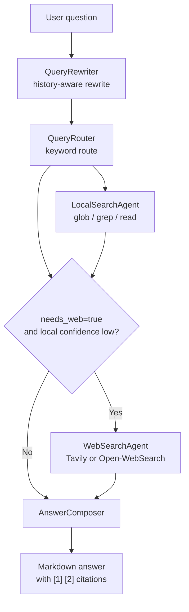

# RAG 搜索流程

DeepMemo 的问答不是直接把问题丢给 LLM。它先改写问题，再路由搜索范围，优先用本地 Markdown 证据回答；只有路由允许且本地证据置信度很低时，才触发 Web fallback。

## QueryRewriter

改写器根据聊天历史把省略问题补全。例如用户追问“那它的风险呢”，系统会结合之前的主题构造更清晰的检索 query。

聊天历史默认保留最近 20 条消息，较早消息会整理进会话摘要，降低上下文膨胀。

## QueryRouter

路由器当前使用硬编码关键词数组匹配 scope，例如 diary、ideas、memory、mock 和 realtime。`deepmemo`、`demo`、`mock` 相关问题会明确路由到 `data/mock`，这是 current spec 保留的公开展示能力。

## LocalSearchAgent

本地搜索是默认主引擎，主要工具是：

| 工具 | 用途 |
|:---|:---|
| `glob_files` | 找候选 Markdown 文件 |
| `grep_content` | 用 `rg` 搜索正文 |
| `read_lines` | 读取证据片段 |

路径访问必须限制在允许的数据目录内，防止越界读取。

## Web fallback

外部搜索不是默认路径。只有同时满足两个条件才触发：

1. 路由判断 `needs_web = true`。
2. 本地检索结果置信度很低。

这样可以避免一个 local-first 工具悄悄变成网络问答工具。

## SSE 输出

流式接口 `/chat/stream` 使用 Server-Sent Events。事件类型包括：

- `token`：增量文本。
- `done`：消息保存完成。
- `error`：生成或保存过程中出现错误。

前端引用面板依赖 `[1]`、`[2]` 这类 citation 标记，不能随意改变证据拼装格式。
