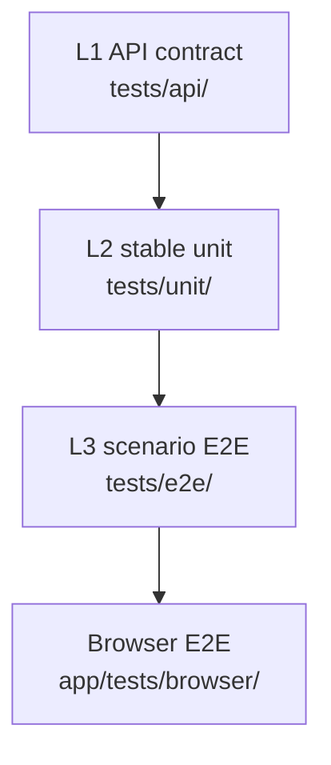

# 沙漏测试模型

DeepMemo 的测试策略像沙漏：API 合约测试最宽，稳定纯函数单测最窄，少量高价值 E2E 场景再变宽。



## L1 API 合约

L1 保护外部可观察行为：状态码、请求响应结构、持久化副作用、安全边界。新增 API 或改 API 行为时，优先补这里。

## L2 稳定单元

L2 只测稳定、小而确定的逻辑，例如路径规范化、frontmatter 解析、格式化和窄工具函数。不要用单测锁死可重构的内部编排。

## L3 场景 E2E

L3 保护用户真正关心的闭环，比如创建文件、提问、引用、Wiki 重建后的可见结果。场景应能跨重构长期存在。

## 隔离规则

测试必须使用临时 `data/` 和临时 SQLite，默认 mock LLM、网络和外部服务。不要让验证污染真实日记、真实 `data.db` 或本地 agent memory。

## 验证入口

常用命令：

```bash
uv run python scripts/verify.py --mode quick
```

完整验证会额外运行浏览器测试：

```bash
uv run python scripts/verify.py --mode full
```
