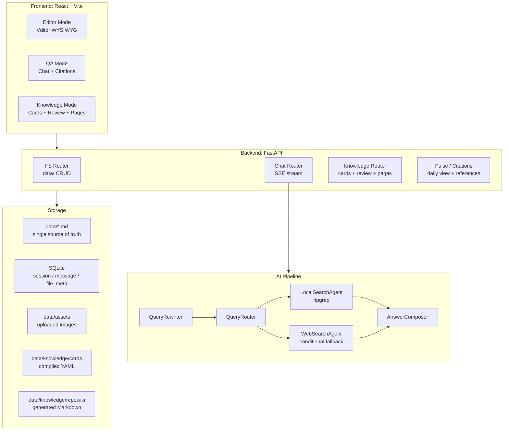

# 系统架构

DeepMemo 是一个前后端分离的本地知识工作台。前端负责 Editor、QA、Knowledge 三种工作模式，后端用 FastAPI 暴露文件、聊天、知识卡片、引用和脉搏等接口；长期知识内容保存在本地 Markdown 和 Knowledge Card 文件里。

## 主要边界

- `app/` 是 React + Vite 前端，默认通过 Vite 代理访问后端。
- `src/app/main.py` 挂载 FastAPI app、CORS、静态 assets、startup watcher 和 routers。
- `src/routers/` 放用户可见 API：文件系统、聊天、Knowledge、引用、脉搏等。
- `src/ai/` 放问答流水线：改写、路由、本地检索、Web fallback、答案合成。
- `src/knowledge/` 放 Card 编译、维护、检索、会话记忆和 RepoWiki 生成逻辑。
- `data/` 是知识库根目录，`data.db` 是元数据数据库。

## 数据流

用户在前端创建或编辑 Markdown 时，文件系统接口把内容写回 `data/`，同时更新 `file_meta`。后台 watcher 也会监听 `data/` 下 Markdown 的系统级变更，把变动文件标为 `dirty`。

用户提问时，聊天接口保存用户消息，构造最近 20 条上下文和较早摘要，调用 RAG 服务生成回答，再保存 AI 消息与 citations。Knowledge 编译从 Markdown 或会话生成 `data/knowledge/cards/`，随后构建只读页面、审阅队列和 RepoWiki。

## 当前风险

有些历史路由和模型仍有重复实现，例如未挂载的 `src/routers/session.py` 与主 app 中的 session API。它们已被 `docs/specs/deprecated.md` 标记为历史包袱，文档站只描述当前挂载和可用的行为。
