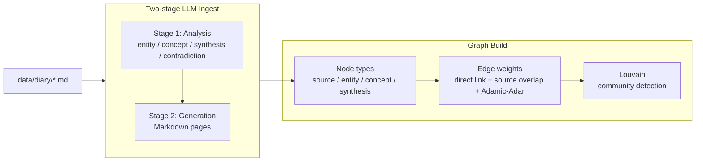

# Wiki 知识图谱

> **历史设计**：旧 Wiki graph 已被 Knowledge Engine 取代。`src/wiki/`、`data/wiki/` 和 Wiki graph workspace 当前不存在。

Wiki 图谱把 `data/wiki/` 中的 Markdown 页面看作节点，把内链、来源交集和拓扑关系看作边。它的目标不是替代阅读，而是帮你看见哪些知识正在形成社区。

## 节点类型

| 类型 | 含义 |
|:---|:---|
| `source` | 来自日记或原始材料的源页面 |
| `entity` | 人、项目、产品、组织等实体 |
| `concept` | 概念、方法、主题 |
| `synthesis` | 跨来源综合后的观点或结论 |
| `query` | 面向问题组织的页面类型 |

页面使用 frontmatter 记录 `title`、`type`、`status`、`tags`、`sources`、`related`、`aliases`、`confidence` 等字段。

## 边权重

历史 `src/wiki/graph.py` 设计包含三类核心信号：

- 直接内链：页面之间显式链接。
- 来源交集：多个页面引用同一批来源。
- Adamic-Adar：通过共同邻居强化隐藏关系。

图谱构建后会输出 communities。旧前端 Wiki 模式曾使用社区和 hub 节点帮助用户浏览。

## 增量构建

Wiki ingest 使用 MD5 和 registry 缓存避免重复消耗 LLM token。未修改的源文件会被跳过，变更文件再进入两阶段处理。

## 健康报告

健康报告用于发现结构问题，例如：

- dangling links：指向不存在页面的链接。
- duplicate candidates：可能重复的页面候选。
- orphan pages：缺少有效连接的页面。
- stub pages：内容过少、需要补全的页面。
