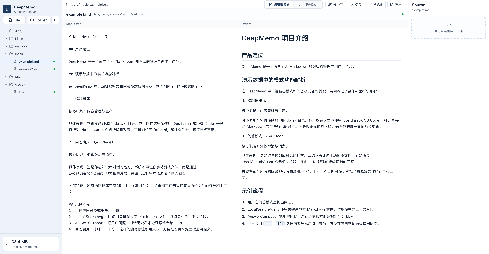
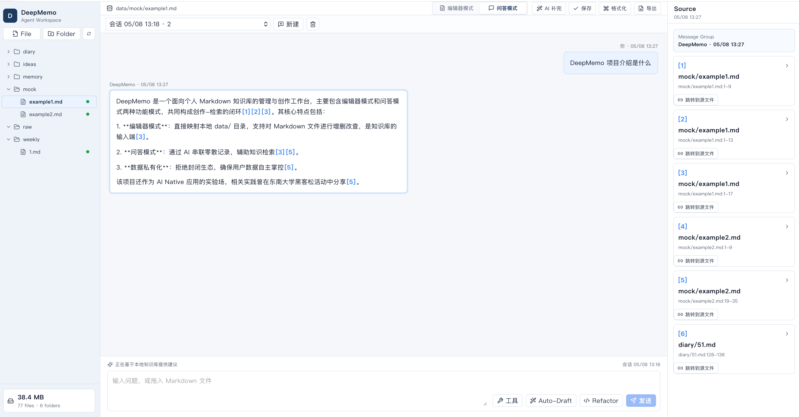

<div align="center">

# DeepMemo

**本地优先的 Markdown 知识库创作与问答工作台**

不要高估一天的产出，也不要小看一周的积淀。DeepMemo 帮你把每天零散的学习记录、工程经验、研究想法和灵感片段，沉淀成可编辑、可检索、可追溯的个人知识系统。


[](LICENSE)

</div>

---

## Why DeepMemo

AI 时代的信息流像多线程任务一样不断抢占注意力：课程、科研、工程实践、技术追新、内容创作和生活本身都在同时运行。DeepMemo 的目标不是再造一个封闭笔记软件，而是给个人 Markdown 知识库加上一层透明的 AI 工作台。

- **文件在你手里**：`data/` 下的 `.md` 文件是唯一真值，离开 DeepMemo 也能继续用编辑器、Git 或 Obsidian 打开。
- **创作和检索闭环**：编辑器模式负责记录和整理，问答模式负责激活和串联。
- **回答可追溯**：DeepMemo 不只给结论，还会把回答绑定到本地 Markdown 片段，使用 `[1]`、`[2]` 这样的引用回到源文件。
- **适合个人长期积累**：日记、idea、memory、raw materials 可以按目录自然生长，不需要一开始就设计复杂知识图谱。

---

## Screenshots
<p align="center">
  
</p>
<p align="center">
  
</p>

---

## Features

### 文件系统驱动的编辑器

- 左侧 Data Explorer 直接映射本地 `data/` 目录。
- 支持读取、创建、保存 Markdown 文件和创建文件夹。
- 文件状态使用 `synced`、`dirty`、`draft`、`processing`、`error` 标记，便于区分本地变更状态。
- 内置基础格式化和面向当前文档的 AI 补完入口。

### 本地知识库问答

- `LocalSearchAgent` 会在 `data/**/*.md` 中检索相关片段，将本地 Markdown 相关信息交给 LLM 生成回答。
- 回答正文中的 `[1]`、`[2]` 引用会绑定到具体文件片段，右侧 Source Panel 可查看原文上下文。
- 支持查询引用了当前文件的历史会话，方便从文件回到对话。

### 可选的外部信息补充

- WebSearchAgent 默认关闭，只有配置后才会在本地证据不足且问题依赖外部实时信息时 fallback。
- 回答侧会区分本地知识库证据和外部搜索补充，避免把外部信息误认为个人记录。
---

## Demo Data

仓库只发布可公开的 mock 知识库数据：

- `data/mock/example1.md`：DeepMemo 的产品定位和问答流程示例。
- `data/mock/example2.md`：AI 时代个人多线程学习和记录压力的案例故事。

真实个人知识库会被 `.gitignore` 忽略，只有 `data/mock/` 会进入 Git。启动后可以在问答模式尝试：

---

## Quick Start

### Requirements

- Python 3.11+
- Node.js 18+
- [uv](https://github.com/astral-sh/uv)
- [ripgrep](https://github.com/BurntSushi/ripgrep)，本地 Markdown 检索依赖 `rg`

### 1. Install

```bash
git clone https://github.com/YeyezhizzZ/deepmemo.git
cd DeepMemo

uv sync

cd app
npm install
cd ..
```

### 2. Configure LLM

创建 `config/llm_api.yaml`。该文件已被 `.gitignore` 忽略，不要提交真实 API Key。

```yaml
model_provider:
  api_key: "sk-..."
  api_base: "https:..."
  model: "model_name"
  max_tokens: 1000
  temperature: 0.7
```

`LLMService` 会读取 YAML 中的第一个 provider，因此 provider 名称可以按你的服务商调整，只要保留 `api_key`、`api_base` 和 `model` 字段即可。

### 3. Run

> 所有命令默认从项目根目录 `DeepMemo/` 执行。

后端 API，默认端口 `8000`：

```bash
uv run uvicorn src.app.main:app --reload

前端应用，默认端口 `5173`：

```bash
cd app
npm run dev
```

打开 http://127.0.0.1:5173 使用 DeepMemo。后端 API 文档位于 http://127.0.0.1:8000/docs。

---

## Project Structure

```text
DeepMemo/
├── app/                    # React + Vite + TypeScript 前端
│   └── src/
├── src/                    # FastAPI 后端
│   ├── ai/                 # RAG、检索、回答生成、WebSearch fallback
│   ├── app/                # 应用入口、数据库、文件监听
│   ├── routers/            # chat、fs、diary、pulse、citations API
│   └── services/           # LLM provider 封装
├── data/
│   └── mock/               # 可公开示例知识库
├── config/
│   └── example.yaml        # 配置占位
```

---

## Architecture

```text
User Question
  -> QueryRewriter
  -> QueryRouter
  -> LocalSearchAgent
       -> glob_files
       -> grep_content
       -> read_lines
  -> WebSearchAgent fallback, optional
  -> AnswerComposer
  -> Markdown answer with citations
```

DeepMemo 当前采用轻量 RAG 思路：先不引入 embedding 和向量数据库，而是使用安全封装的本地搜索工具在 Markdown 文件中召回证据。这样更适合个人 MB 级知识库，也降低了索引维护成本。

---

## Tech Stack

- Frontend：React 18、TypeScript、Vite、Lucide React
- Backend：FastAPI、Pydantic、SQLite
- AI：OpenAI-compatible Chat Completions API
- Local search：ripgrep + 受控文件读取工具
- Optional web search：Tavily、Open-WebSearch MCP

---

## Security Notes

- `data/*` 默认不提交，只发布 `data/mock/**`。
- `config/llm_api.yaml`、`.env`、`*.db`、`.claude/` 已被 `.gitignore` 忽略。
- 本地检索工具只允许访问 `data/` 下的 Markdown 文件，并会校验路径，避免 `../` 越界读取。
- 发布前请确认没有把真实日记、API Key、私有记忆或本地 agent 配置加入 Git。

---

## License

DeepMemo is open-sourced under the [MIT License](LICENSE).
